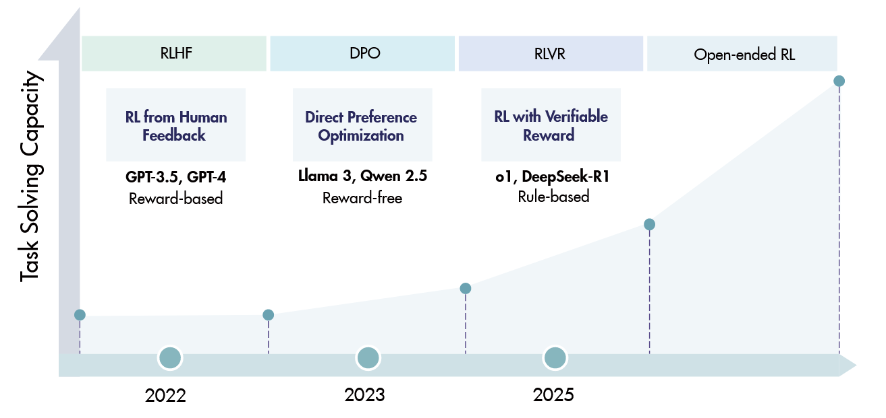
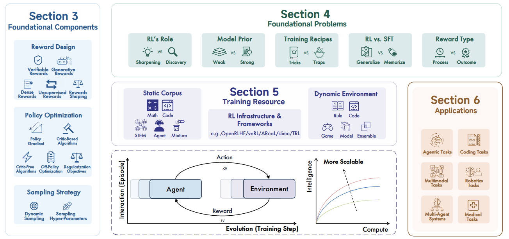
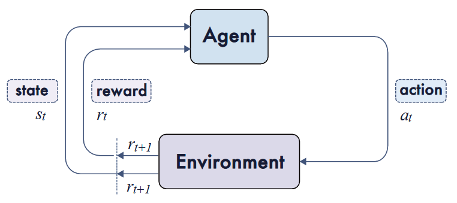
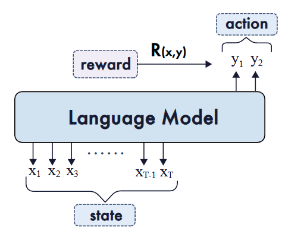
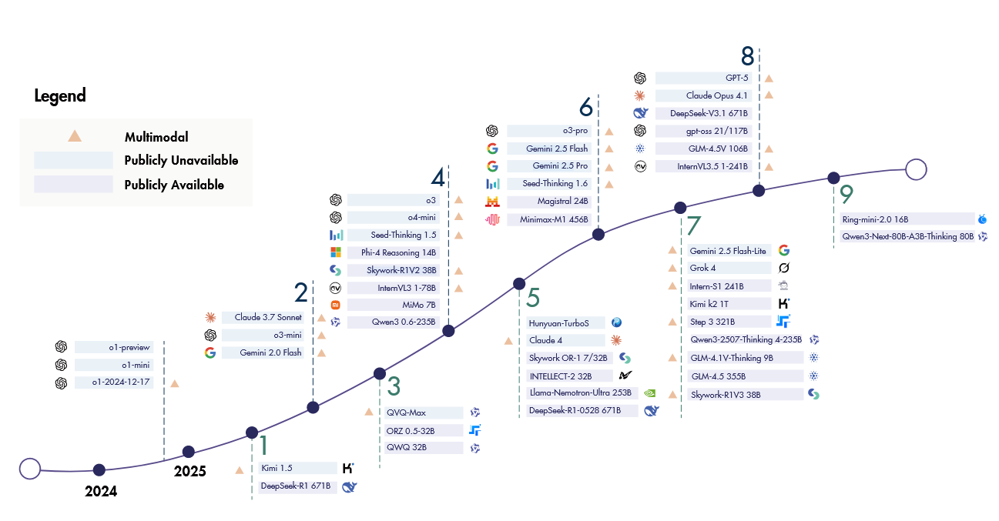
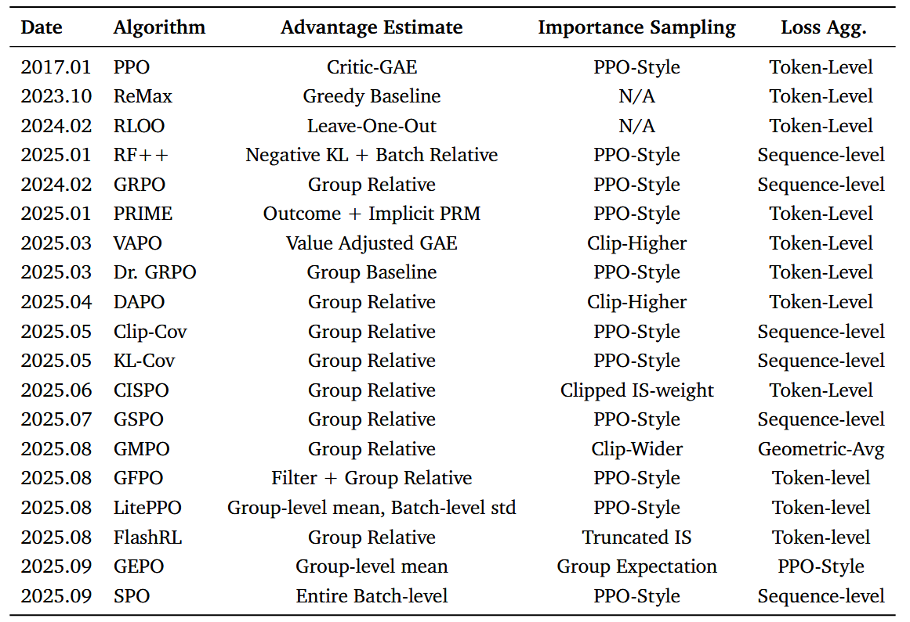

+++
date = '2025-09-24'
draft = false
title = 'LRM-RL-survey'
image = 'sky.jpg'
author = 'DaYang'
categories = ['Notes']

+++

# A Survey of Reinforcement Learning for Large Reasoning Models

## Background
RL在推进LLM能力的前沿方面取得了显著成功，特别是在解决数学和编码等复杂逻辑任务方面。因此，RL已成为将LLM转化为LRM的基础方法。  

需要探索提高强化学习向人工超级智能（ASI）的可扩展性的策略。  

回顾一下大致流程吧！  

## 简单讲解一下RL应用到语言模型的时候，这些概念映射到了哪里  

- Prompt/Task（x）：对应于初始状态或环境上下文，从数据分布中提取，对应于数据集D。

- Policy (πθ):表示语言模型，它根据提示生成一个长度为T的序列，表示为y=（y1，…，yT）。

- State (st):定义为提示以及到目前为止生成的令牌，即st=（x，a1:t−1）。

- Action (at):在步骤t从动作空间A中选择的单元。根据粒度，动作可以是整个序列y（序列级）、∈V处的令牌（令牌级）或 片段

- Transition Dynamics (P):在LLM的上下文中，状态转换通常是确定的，因为st+1=[st，at]，其中[·，·]表示字符串连接。当状态包含EOS令牌时，策略将转换为终端状态，这意味着轨迹结束。

- Reward (R(x, y) or rt):基于动作粒度进行分配，例如，轨迹末端的序列级别R（x，y），每个令牌的令牌级别rt=R（x、a1:t），或每个分段的步长级别rk=R（x、y（1:k））。

- Return (G):提示x的整个轨迹y的累积奖励（通常在有限时间内γ=1）。它通过序列级奖励简化为单个标量R（x，y），否则按每个令牌/步骤聚合奖励

## Frontier Models
按时间顺序排列在三个主要方向上：LRM、agentic LRMs和多模态LRM。  
一个大型推理模型，OpenAI的o1[2024]系列，建立了将训练时间RL和测试时间计算扩展到更强大的推理能力的有效性，在数学、编码和科学基准测试方面取得了领先成果。  
DeepSeek的旗舰模型R1[2025a]是第一个在基准测试中与o1性能相匹配的开源模型。它采用多阶段训练管道来确保全面的模型能力，并探索了没有监督微调的纯RL路线（即Zero RL）。  
其他专有模型发布紧随其后：Claude-3.7-Sonnet[2025a]以混合推理为特色，Gemini 2.0和2.5[2025]引入了更长的上下文长度，Seed Thinking 1.5[2025b]以跨领域的泛化为特色，o3[2025a]系列展示了越来越先进的推理能力。最近，OpenAI推出了他们的第一个开源推理模型gpt-oss-120b[2025a]，随后推出了GPT5[2025a]，这是他们迄今为止最强大的人工智能系统，可以在高效模型和更深入的推理模型gpt-5思维之间灵活切换。并行的开源努力继续扩大了格局。在Qwen家族中，QwQ-32B[2025g]与R1的表现相匹配，其次是Qwen3[2025a]系列，代表性型号Qwen3-235B进一步提高了基准分数。Skywork-OR1[2025d]模型套件基于R1蒸馏模型，并通过有效的数据混合和算法创新实现了可扩展的RL训练。Minimax-M1[2025a]是第一个有效地将混合注意力引入尺度RL的模型。其他作品包括Llama Nemotron Ultra[2025]，旨在平衡准确性和效率；Magistral 24B[2025]，通过RL从头开始训练，而不是从先前的模型中提炼；以及种子OSS[2025a]，强调长上下文推理能力。等等...  

过去的一年发展迅速啊！

---

## Foundational Components
### Reward Design  
在1.1中，我们对LRM RL中的奖励设计进行了全面的考察。从可验证的奖励开始，DeepSeek-R1的成功就是例证，它通过可验证的奖励机制证明了RL的可扩展性。  

在1.2中，我们考察生成性奖励，其中模型用于验证或直接生成奖励信号。  

然而，可验证和生成性奖励通常都表示为稀疏的数值反馈。一个重要的互补维度在于奖励信号的密度。  

1.3相应地考察了包含密集奖励的方法。另一个分类轴涉及奖励是根据外部真实情况计算的，还是由模型直接估计的。  

这一区别促使我们在1.4中讨论无监督奖励。  

在这四个类别的基础上，我们在1.5中转向奖励塑造，在那里我们分析了组合或转换不同奖励信号以促进学习的策略。  

### Verifiable Rewards
基于规则的奖励通过利用准确性和格式检查，为RL提供可扩展和可靠的训练信号，特别是在数学和代码任务中。  

Verifier定律强调，具有清晰和自动验证的任务可以实现高效的RL优化，而主观任务仍然具有挑战性。   

### Rule-based Rewards
- Accuracy rewards:对于具有确定性结果的任务（例如数学），策略必须在规定的分隔符（通常为\boxed{…}）内产生最终解决方案。然后，自动检查器将此输出与地面实况进行比较。对于编码任务，单元测试或编译器提供通过/失败信号  

- Format rewards:这些奖励施加了一个结构约束，要求模型将其私有思想链放置在<think>和</inthink>之间，并在单独的字段中输出最终答案（例如<answer>…</answer>）。这提高了大规模RL中的可靠解析和验证  

### Rule-based Verifier

基于规则的奖励通常来自基于规则的验证器。这些依赖于大量手动编写的等价规则来确定预测的答案是否与基本事实相匹配。目前，广泛使用的数学验证器主要基于Python库Math-Verify1和SymPy2构建。此外，一些作品，如DAPO[2025d]和DeepScaleR[2025c]，也提供了开源和成熟的验证器。最近，Huang等人[2025e]强调了与基于规则和基于模型的验证器相关的独特局限性，为设计更可靠的奖励系统提供了信息。  

#### 训练人工智能系统执行任务的难易程度与任务的可验证程度成正比

### Generative Rewards

#### 这里着重说明 Generative Rewards for Non-Verifiable Tasks
- Reasoning Reward Models (Learning to Think)  

- Rubric-based Rewards (Structuring Subjectivity)：强调细粒度奖励  

- Co-Evolving Systems (Unifying Policy and Reward):  

    - Self-Rewarding：自我奖励，一个模型既充当policy model，也充当reward model  

    - Co-Optimization：policy和reward模型共同训练  

### Dense Rewards  
dense rewards 和 verifiers对于open-domain还是太难了  

Scaling remains challenging for tasks like open-domain text generation due to the difficulty of defining dense rewards or using verifiers.  

Granularity细粒度分为：Trajectory（整个序列），Token，Step，Turn（Agent）  
这几个信号可以相互转换，比如把globa returns 转换成 localized signals，奖励的重新分配  
可以理解为从每次交互中直接分配和从结果中分解得出的回合级别奖励 
### Unsupervised Rewards
cluster：聚类（也有集群的意思）  

majority vote：多数投票  

Heuristic Rewards（启发式奖励）：这种方法构成了另一种基于规则的奖励形式，采用基于输出属性（如长度或格式）的简单预定义规则作为质量的代理。由DeepSeek-R1开创。不会提高模型真正能力？（质疑）

### Rewards Shaping
Rewards Shaping将稀疏信号丰富为稳定的、信息丰富的梯度，用于LLM训练  
- Rule-based Reward Shaping  
    最简单的：把rule-based verifier和reward model组合起来生成overall reward signal。通常有一个constant coefficient平衡the contributions of the reward model and the rule-based component，不是所有正确的responses都是同样的scores，这样可以把所有的responses重新排序，避免无效的学习梯度  
    
    这种启发式组合策略在开放域任务中得到了广泛的应用，提供了更多的信息和有效的奖励信号。  
    
    另一种方法是DeepSeek-R1中实现结果级奖励和格式奖励，能让LLM学习长思维链推理，用于解决LLM输出中的各种异常。
- Structure-based Reward Shaping
    Pass@k在推导和分析优势和有效近似值时，将集合级目标分解回单个样本信用分配。
### Policy Optimization
最近的研究把on-policy RL和offline datasets结合在一起来进行optimization同时使用各种regularization techniques（正则化技术）比如entropy和KL防止overfitting  
#### environment:the context in RL for LLMs
#### policy:the distribution of the next-level prediction
#### 由于LLM中的大量参数，LLM的RL策略优化算法大多是基于一阶梯度的算法

### Notations（符号）
#### 当前状态s的预期积累奖励表示为V（value）函数
#### 当前状态动作对应的预期积累表示为Q（quality）函数
#### 优势函数：A(s, a) = Q(s, a) − V (s).该优势衡量的是与现有政策相比，当前行动在预期总回报方面有多大改进。
### 优化算法的历程
PPO算法[Schulman等人，2017b]首次被提出作为TRPO算法[Schurman等人，2015a]的计算高效近似。  

### Critic-based Algorithms
critic需要和LLM一起run和update，这样会导致巨大的计算开销，而且对于复杂的任务来说，扩展性不好  

### Critic-Free Algorithms
只需要sequence-level rewards for training  

对于RLVR任务可以防止reward hacking等问题，这使得Critic-Free Algorithms更具有可扩展性    

最近的研究表明response-level足以用于RL的可扩展推理任务  

最受欢迎的critic-free approach是GRPO，新推出的GSPO[Zheng等人，2025a]，用序列级剪切代替了逐符号剪切的重要性采样率  

SPO引入了一种无组、单流策略优化，用持久的KL自适应值跟踪器和全局优势归一化来替换每组基线，从而产生比GRPO更平滑的收敛和更高的精度
#### Importance Sampling for Policy Optimization
TRPO引入了RL中重要性抽样的第一个版本，其中在目标中引入了令牌式重要性比wi，t  
这种方法在最近的工作中被广泛采用，如GRPO。由于无法在CoT的长上下文中有效计算实际分布比率，因此这种方法仅限于token-level重要性比率  

token-level重要性采样在RL算法中引入了另一种偏差，因为实际采样分布给定的策略是针对状态-动作对定义的，而token-level方法只考虑当前动作。GMPO[赵等人，2025f]通过引入几何平均来寻求缓解，以提高具有极端重要性采样率的token的训练鲁棒性  

在GSPO的最新工作中[Zheng等人，2025a]，计算了序列级重要性抽样因子。GSPO添加了一个唯一的归一化因子，以确保可以计算概率比，但这种方法也是对实际重要性抽样因子的有偏估计
### Off-policy Optimization
Off-policy RL通过把data collection 和 policy learning解耦，实现了从历史、异步或离线数据集进行训练，从而提高了样本效率   

选择性地replay 早期的推理traces可以提高exploration for LLM reasoning  

现在很多都在对数据进行处理来提升exploration  

### Regularization Objectives
Objective-specific regularization helps balance explration and exploitation,boosting RL effiency and policy performance.  

KL,entropy and length regularization remain open questions,each affects policy optimization and scalability  

Length Penalty建议应用基于问题难度的自适应长度惩罚来保持模型的能力  

### Sampling Hyper-parameters
#### Exploration and Exploitation Dynamics  

一些工作提出了一种动态方法，例如分阶段提高温度(e.g., 1.40 → 1.45 → 1.50 for a 4B model, 0.7 → 1.0 → 1.1 for a 7B model)  

entropy 在0.3被发现是最佳平衡  

其他的工作只是倡导提高一个固定的温度（例如1.0或1.2）来鼓励初步探索，同时指出它本身不足以防止长期的熵下降

#### Length Budgeting and Sequence Management
几乎所有的work都在努力管理生成响应的长度，以平衡性能和成本。
- This involves starting RL with a short context window (e.g., 8k) before progressively increasing it to 16k, 24k, or 32k in later stages  

初始的短上下文阶段被认为是必不可少的，因为它迫使模型学习更简洁、更具令牌效率的推理模式

## Foundational Problems

### RL’s Role: Sharpening or Discovery
### RL vs. SFT: Generalize or Memorize
发现RL擅长巩固和增强现有能力，而SFT在引入新知识或新模型能力方面更有效
### Model Prior: Weak and Strong
- R1-Zero：直接将大规模基于规则的RL应用于基本模型，产生新兴的长期推理  

- R1：包含冷启动  

基础模型先验比指导模型更适合强化学习，通常会产生比从高度一致的指导模型开始时观察到的更平滑的改进轨迹，其中根深蒂固的格式和服从先验可能会干扰奖励的形成
#### Model Family Differences
### Reward Type: Process or Outcome

## Training Resources
### Static Corpus
- Math

- Code

- STEM

- Agent

- Mixture

### RL Infrastructure & Framework  
e.g.OpenRLHF/veRL/AReaL/slime/TRL
### Dynamic Environment
- Rule

- Code

- Game

- Model

- Ensemble

### Applications
- 1.Agentic Tasks

- 2.Coding Tasks

- 3.Multimodal Tasks

- 4.Robotics Tasks

- 5.Multi-Agent Systems

- 6.Medical Tasks

---
