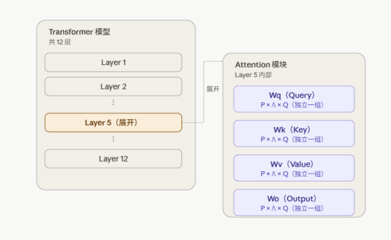

---
title: "Lora"
description: ""
date: 2026-07-22T21:00:00+08:00
slug: 
image:  ''
math: false
license: 
hidden: false
comments: true
draft: false
categories:
    - Notes

--- 
### 技术产生原因  
[LoRA: Low-Rank Adaptation of Large Language Models](https://arxiv.org/abs/2106.09685)  

1. 显存占用大
2. 存储成本高
3. 切换任务效率低

### 原理  
#### 数学表达  
对于原始权重矩阵 W₀（维度为 d×k），全参数微调是直接更新为 W₀+ΔW，ΔW与W₀维度相同
 
LoRA的做法是冻结W₀不变，将ΔW分解为两个低秩矩阵的乘积：
 
```
ΔW = B × A
```
 
其中：
- A 的维度为 r×k
- B 的维度为 d×r
- r 是秩（rank），是一个远小于d和k的超参数，常见取值为4、8、16、32、64
前向传播时的计算变为：
 
```
h = W₀x + ΔWx = W₀x + BAx
```
 
训练时只更新A和B这两个小矩阵，W₀始终冻结不参与梯度更新

e.g.
假设原矩阵维度为 d=k=4096（常见于大模型的注意力层），全参数微调需要更新 4096×4096 ≈ 1677万参数

若取 r=8，LoRA只需更新：
- A矩阵：8×4096 = 32768
- B矩阵：4096×8 = 32768
- 合计：65536参数
参数量减少约256倍。这直接导致：
- 梯度计算量大幅减少
- 优化器状态占用大幅减少
- 最终保存的权重文件只需保存A、B两个小矩阵，通常几MB到几十MB

#### 初始化方式
 
训练开始时，A矩阵通常用高斯随机初始化，B矩阵初始化为全零矩阵。这样保证训练刚开始时 BA=0，即ΔW=0，模型初始状态等价于原始预训练模型，不会因为随机初始化破坏原有能力，训练过程平稳

#### 推理时的处理
 
训练完成后，可以将 B×A 直接加到W₀上得到新的权重矩阵 W₀+BA，这一步是简单的矩阵加法运算。这意味着推理时不会引入额外的计算延迟，因为最终使用的还是一个完整的d×k权重矩阵，结构和原模型完全一致
 
如果不合并，也可以保持A、B独立存在，前向传播时并行计算W₀x和BAx后相加，这样便于同一个基座模型加载不同任务的多组A、B，实现快速切换

#### 作用位置
 
LoRA通常不作用于模型的全部权重矩阵，而是选择性地作用于特定层，最常见的是Transformer结构中注意力模块的权重矩阵（Query、Key、Value、Output的投影矩阵），也可以扩展到前馈网络层。作用的层数量和位置是可配置的超参数，会影响效果和训练开销的平衡


### 关键超参数

| 超参数 | 说明 |
|---|---|
| **r（秩）** | 决定低秩矩阵的维度，r越大表达能力越强，但参数量和计算量也越大，同时也越接近全参数微调 |
| **alpha（缩放系数）** | 用于控制ΔW对原始输出的影响程度，实际计算中会有一个缩放因子 alpha/r 乘在BAx上 |
| **target_modules** | 指定对哪些权重矩阵施加LoRA |
| **dropout** | 在LoRA模块中加入的dropout比例，用于防止过拟合 |


### 常用框架与工具
 
1. **PEFT（Parameter-Efficient Fine-Tuning）**：由HuggingFace开发的库，是目前最主流的LoRA实现工具，支持与Transformers库无缝结合，同时支持LoRA的多个变体（如AdaLoRA、QLoRA等）。
2. **QLoRA**：在LoRA基础上结合量化技术，将基座模型量化为4-bit精度存储，同时保持LoRA部分为可训练的浮点参数，进一步降低显存占用，使得在消费级显卡上微调较大模型成为可能。
3. **LLaMA-Factory**：国内团队开发的开源训练框架，封装了包括LoRA在内的多种微调方法，提供命令行和Web界面，适合快速上手。

### 常见变体
 
- **QLoRA**：结合4-bit量化，降低显存占用
- **AdaLoRA**：训练过程中动态调整不同层的秩分配，而非固定统一的r值
- **DoRA（Weight-Decomposed Low-Rank Adaptation）**：将权重分解为幅度和方向两部分分别处理，是2024年提出的改进方法


### QLoRA  
解决显存占用问题
[QLoRA](https://arxiv.org/abs/2305.14314)  
#### 核心思路  
把基座模型压缩到4-bit存储，同时保持LoRA部分的训练精度不变  

#### 原理  
1. NF4量化：一种专门针对正态分布权重设计的4-bit数据类型，量化区间根据正态分布的分位数划分，而不是简单等间距划分，因此在权重数值集中的区域（0附近）保留更多精度，整体量化误差更小  
2. 双重量化：量化过程中每个数据块需要存储一个32位的缩放常数，双重量化把这些缩放常数本身也压缩为8位，进一步减少显存占用

#### 计算过程  
基座权重以4-bit存储，但实际做矩阵乘法时会临时反量化为bf16精度参与计算，计算完立即释放，不常驻高精度副本。真正被训练更新的仍然只有LoRA新增的A、B矩阵，且这两个矩阵全程保持bf16精度，不参与量化


### AdaLoRA  
论文里明确指出它要解决的问题是：**原始LoRA给所有层统一分配相同的秩r，忽略了不同权重矩阵对下游任务的重要性差异**

[AdaLoRA](https://arxiv.org/abs/2303.10512)

#### 奇异值分解（SVD）  
奇异值分解（Singular Value Decomposition，简称SVD）是线性代数中的一个基本定理：任意一个矩阵，都可以分解成三个矩阵的乘积

#### 重要性打分

敏感度(wij) = |wij × ∇wij L|
> 如果只用其中某一步的值来判断这个参数重不重要，结果会很不稳定

滑动平均（Exponential Moving Average, EMA）： 

I(t)(wij) = β1 × I(t-1)(wij) + (1-β1) × I(t)(wij)

> 这个公式的意思是：新的平滑值 = 85%的历史平滑值 + 15%的这一步新值

"不确定性"，衡量的是"这一步的新值，跟历史平滑值差了多少"：
U(t)(wij) = β2 × U(t-1)(wij) + (1-β2) × |I(t)(wij) - I(t)(wij)|
这个不确定性指标的作用：如果一个参数每一步的值都跟历史平滑值差得很远（U值一直很大），说明这个参数的重要性评估很不稳定，不能完全信任；如果每一步的值都很接近历史平滑值（U值很小），说明这个参数的重要性评估很稳定可靠

最终打分：两者相乘
s(t)(wij) = I(t)(wij) × U(t)(wij)
意思是：一个参数只有当它本身敏感度高（I大），同时最近又出现了明显的变化（U大，说明它的重要性正在剧烈调整、可能正处在关键的学习阶段），才会被认为是最值得关注的参数

从"单个参数打分"组合成"一个方向（triplet）的打分"
Si = s(λi) + (1/d1)Σ(k=1到d1) s(Pki) + (1/d2)Σ(k=1到d2) s(Qik)
这个公式在算的是：第i个方向（也就是Λ对角线上第i个位置）的总重要性得分

把全模型所有方向的Si放在一起排序,排名靠后的方向对应的λi直接置零，实现动态裁剪

#### 步骤  
| 步骤 | 内容 |
|---|---|
| 1 | 给每个目标权重矩阵（如每层的Wq、Wk、Wv、Wo）各自初始化一组P、Λ、Q，Λ的初始秩通常偏大 |
| 2 | Λ里每个对角线位置代表一个独立的"方向"，训练时每个方向单独计算敏感度分数并做滑动平均 |
| 3 | 把全模型所有矩阵、所有方向的分数汇总到一起统一排序 |
| 4 | 按照预设的全局总预算，分数最低的方向逐步置零，不区分它属于哪一层 |
| 5 | 训练结束后，不同层、不同矩阵保留的实际有效方向数量各不相同，重要的层保留得多，不重要的层保留得少 |




具体改进包含两部分：

#### 改进点1：把ΔW参数化为SVD形式

原始LoRA：ΔW = BA（B、A没有正交约束）

AdaLoRA：ΔW = PΛQ（P、Q近似正交，Λ的对角线是"奇异值"）

相对于"直接对BA做结构化剪枝"（整组丢弃某个doublet）的优势：BA的B和A不是正交的，各个doublet之间可能存在依赖关系，如果直接丢弃一个doublet会导致矩阵变化剧烈，训练不稳定；而PΛQ形式下，只需要把不重要的奇异值置零，对应的奇异向量（P、Q的那一列/行）仍然保留着，未来如果发现这个方向其实重要，还有"复活"的可能，训练也更平稳  

#### 改进点2：重要性打分机制

不是简单用奇异值大小 |λᵢ| 判断重要性，而是把奇异值本身的大小，加上它对应的P列、Q行里每个参数的敏感度（参数值×梯度，并做了平滑+不确定性调整），三者加权组合成综合得分。消融实验证明这个组合打分比单纯用|λᵢ|或单纯用敏感度效果更好

#### 改进点3：全局预算调度器（Global Budget Scheduler）

不是一开始就按目标预算裁剪，而是先给一个比目标预算略高的初始预算（如1.5倍），warm-up之后按三次方曲线逐渐降到目标值。让模型先探索完整参数空间，再逐步聚焦到重要权重，提高训练稳定性

### IGU-LoRA —— 相对于AdaLoRA的改进

用积分梯度（Integrated Gradients, IG）替代瞬时梯度敏感度

AdaLoRA的敏感度公式：|wᵢⱼ × ∇wᵢⱼL|，只看当前这一步的梯度

敏感度(wij) = |wij × ∫₀¹ ∂L(α·ΔW)/∂wij dα|  
#### 流程

1. 正常训练A、B（跟普通LoRA一样）
2. 每个mini-batch训练完，顺便对AB做一次SVD，得到PΛQ
3. 用当前这个mini-batch随机采样到的α点，算一次积分梯度的抽样估计（针对P、Q里每个参数）
4. 一个epoch跑完后，把这个epoch内所有mini-batch的抽样估计取平均，得到这一epoch的聚合敏感度
5. 用滑动平均+不确定性量化，算出最终的SNR打分
6. 结合每个奇异值本身的大小，算出每个方向（每个triplet）的综合重要性得分
7. 全局排序，挑出分数最高的前b个方向保留，其余的对应奇异值置零
8. 把保留下来的部分重新组装回A、B两个矩阵，继续下一轮训练

### Revisiting Weight Regularization

持续学习（Continual Learning）场景下怎么避免遗忘之前学过的任务的问题

维护一个Fisher信息矩阵，记录"之前的任务认为哪些位置的权重变化很重要"，在训练新任务时，往损失函数里加一个正则化项，惩罚在这些重要位置上的大幅改动