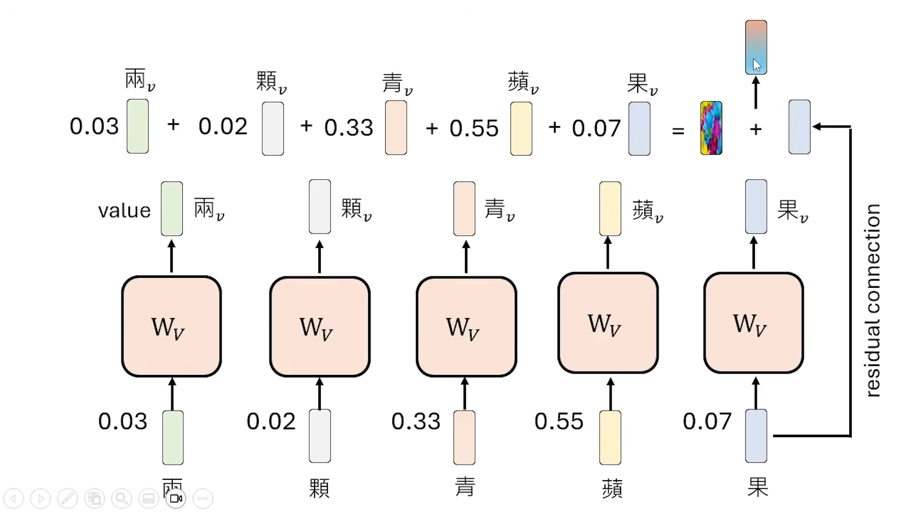
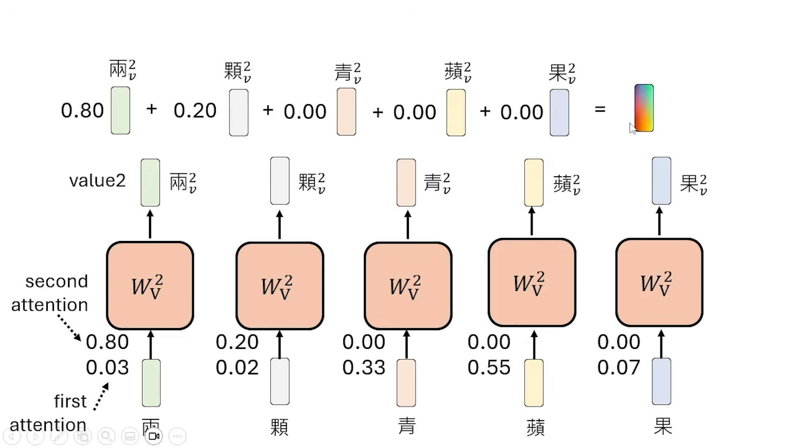
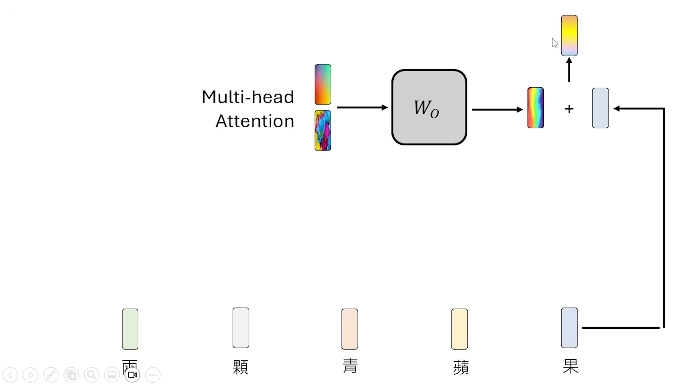
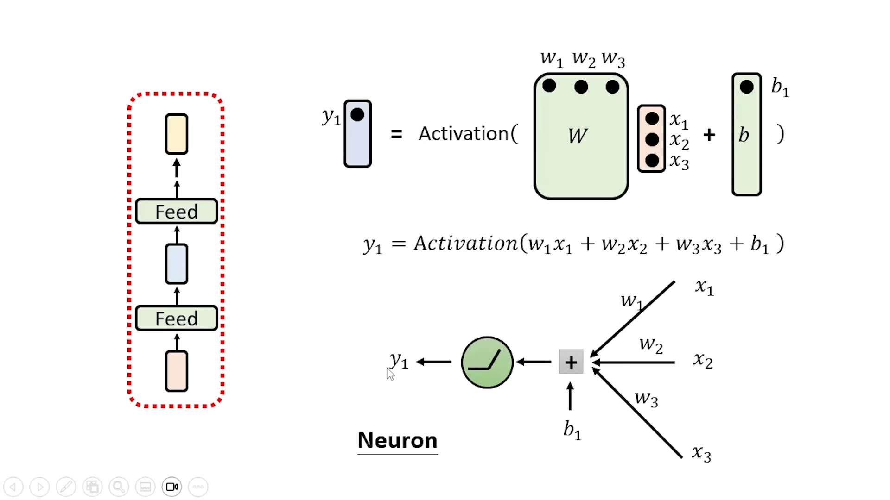

---
title: "NLP"
description: "How LLMs Work"
date: 2026-01-19T10:00:00+08:00
slug: 
image:  ''
math: false
license: 
hidden: false
comments: true
draft: false
categories:
    - Notes

--- 

## 【生成式人工智慧與機器學習導論2025】第3講：解剖大型語言模型representation
https://www.youtube.com/watch?v=Xnil63UDW2o

Token Embedding 是在Layer 1输入的那个， Contextualized Embedding(也就是我们说的representation表征) 指的是经过Layer 1输出的那个.

Representation Engineering, Activation Engineering, Activating Steering...

### Logit Lens

对每一层进行 Unembedding ,可以看每一层的思考所对应的文字，窥探语言模型的思考过程

### Patchscopes

把一个向量（一个token/字）替换成一句话

### Layer解读（使用Transformer架构的解读）

Layer 中还有 Layer.

首先过 Self-attention Layer (attention layer), 考虑上下文就是因为 attention layer, 输出经过几个 Feed Forward Layer 

典中典，要求手撕 Attention Layer , 

自己跟自己也要进行dot product

dot product 叫 Attention weight, 要所有的 weight 过 Softmax

#### Positional Embedding

Llama 用 Rope , 旋转位置编码, 为了把位置的咨询加入到计算中

#### Multi-head Attention

每一个 head 的作用不一样






目前的语言模型大多数都是 Causal Attention, 这样计算方便(Autogressive)




### 实做环节
```
model.num_parameters()会告诉我们 model 的参数量
```

深度学习模型的参数通常以多个矩阵 (Matrix) 和向量 (Vector) 的形式存储。向量、矩阵等统称为张量(Tensor)

Llama3 有28层，Gemma4B 有44层

```
model.state_dict() 可以实际把参数拿出来看看
```


## 一文看懂大模型推理过程

内容特别简单，适合感兴趣的小白简单阅读  
https://zhuanlan.zhihu.com/p/1931115470431454357

### TTFT（Time To First Token）

Tokenizer + Prefill 

一般是推理过程里耗时最多的一步，尤其当输入内容多、模型参数大时

### TPOT（Time Per Output Token）

Decoding Loop中的每一次推理

模型每“说”一个字/词的时间  
TPOT 越低，响应越流畅。  
但模型越大，TPOT 越高；  
GPU 负载越高、token越复杂，TPOT 也会变慢。

### ITL（Inference Time Latency）

Tokenizer + Prefill + Decoding Loop + Post-processing  

ITL = 从你提问到回答完整输出的总耗时。

它 = TTFT + n × TPOT


## Engram

https://zhuanlan.zhihu.com/p/1994328242795090231

## 微调技术

https://zhuanlan.zhihu.com/p/636481171

## The Big LLM Architecture Comparison 

https://magazine.sebastianraschka.com/p/the-big-llm-architecture-comparison

## Understanding Reasoning LLMs

https://magazine.sebastianraschka.com/p/understanding-reasoning-llms