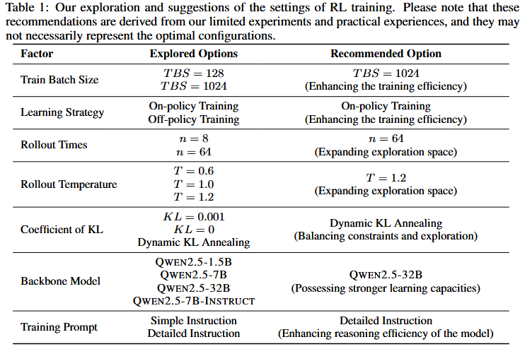

+++
date = '2025-10-02'
draft = false
title = 'STILL3'
image = ''
author = 'DaYang'
categories = ['Notes']

+++

重新认真地读一遍STILL3(LLMs慢思维技术报告III )，补充知识点  
 
# An Empirical Study on Eliciting and Improving R1-like Reasoning Models  

[慢思考模型仓库](https://github.com/RUCAIBox/Slow_Thinking_with_LLMs)  

缺乏可验证问题的领域:如DeepSeek-R1,基于规则和训练的奖励模型的联合使用  

随着训练的进行，可以观察到三个主要特征：**增加训练奖励**、**增加响应长度**和**涌现推理模式**。些因素是扩大强化学习训练成功的**关键指标**。  

在本报告中，首先深入研究了强化学习**设置对训练效果的影响**。接下来，通过强化学习训练直接激励基础模型发展复杂的推理能力，**观察到模型逐渐花费更多的时间“思考”并表现出高级推理行为（例如，验证或反思）**。最后，为了进一步增强微调模型的推理能力，探索了**强化学习和工具增强作为提高模型推理性能的策略**，在小型（1.5B）和中型LLM（32B）中都取得了显著的改进。  

- on-policy learning strategy被证明是关键因素！  

- response length是RL训练成功的重要指标，这是结果，不是原因  

- 设计专门的奖励函数来鼓励模型产生更长的响应可能会导致奖励黑客攻击等问题，这不能从本质上增强模型的推理能力  

- 无论是短CoT还是长CoT，还是蒸馏过的模型，强化学习都可以提高能力  

- 通过fine-tuning，LRM可以获得操纵外部工具的能力，从而提高模型的性能。这种能力只需少量高质量的训练实例即可激活。  

[复现点这里找资源](https://github.com/RUCAIBox/Slow_Thinking_with_LLMs)  

# 实验设置  

## 训练框架  
OpenRLHF和veRL  

## 骨干模型  
各种版本的QWEN2.5模型  

DEEPSEK-R1-DISTILL系列的1.5B和32B QWEN2.5  

在微调模型上进行实验，微调数据由自己合成。  

## 训练数据  

#### 多样性  
AIME,MATH,NuminaMath,Open Reasoner Zero
#### 可验证性  
删除了多选题，证明题，概念题，开放式问题和有多个子问题的问题  
再把答案不可能的数据删掉  
#### 困难程度  
基于模型的过滤，QWEN-7B-INSTRUCT正确率过高或者零通过率的题目删掉  

最后剩下90k个examples  

## Reward Design  
设计并验证了一组不同的奖励，并分析了它们对模型性能的影响，包括输出奖励、格式奖励、长度奖励和动作奖励。

输出奖励评估 最终答案是否与ground truth匹配。如果答案正确，我们将奖励设置为1，否则设置为0。  

如果模型未能将其最终答案放入\boxed{}中，则奖励设置为0。  
使用格式奖励来指导基础模型正确构建其响应。  

探索了新的辅助奖励，包括鼓励更长反应的长度奖励和激励复杂推理行为的行动奖励。  
## Evaluation Benchmarks  
评估了各种数学推理任务的模型性能，包括MATH-OAI[13]、AIME、Omni-MATH[17]、LiveAOP[18]和HMMT。  
iveAOP利用AoPS论坛的帖子创建了一个由3863个示例组成的抗污染评估集。  
## Compute Environment  
实验主要在DataCanvas的旗舰计算编排平台Alaya NeW AI操作系统上进行。  

# RL Experiments on the Base Model  
直接将RL应用于预训练的基础模型进行实验，而不需要任何中间的SFT阶段。这种方法旨在探索LLM是否可以通过纯粹的RL驱动的自我提升来自主发展推理能力  
#### 考察了四个关键维度
### 1.训练超参数的影响
### 2.比较不同的基础模型并将其与具有短CoT推理能力的微调模型进行对标，来分析骨干模型的效果
### 3.快速设计对RL训练中基础模型推理能力的影响
### 4.代表性推理模式（如验证或反射）的出现

## Exploring the Settings of RL Training
重点分析两个关键方面的影响：超参数和训练提示。  
### Influence of Training Hyper-parameters
#### Train Batch Size(TBS)
TBS=128 v.s.1024  
更大的TBS可以显著提高训练效率，使模型在早期训练阶段能够快速提高性能。此外，与较小批量相比，较大批量的训练表现出更大的稳定性，训练指标的波动显著减少  
#### Learning Strategy: On-policy vs. Off-policy
on-policy 鼓励更多的探索；在训练过程中，模型自然快速地增加了响应长度，而更新较少的非策略学习在长度增长方面遇到了瓶颈  
#### Rollout Parameters
主要研究两个rollout parameters（rollout times和rollout temperature）  
更大的推出数量和更高的温度通常表示更大程度的探索  
#### Coefficient of KL Penalty
动态KL退火具有很好的综合性
#### Effect of Backbone Models
上述实验基于QWEN2.5-7B。此外，还对较小的QWEN2.5-1.5B模型、监督微调QWEN2.5-7B-INSTRUCT模型和数学专用QWEN2.5-math-7B模型进行了实验。  

在上述设置下，我们的实验表明，与QWEN2.5-1.5B相比，QWEN2.5-7B表现出更强的探索能力，并且在强化学习训练中遵循与QWEN2.5.7B-INSTRUCT类似的趋势。
## Impact of the Prompt
使用两种基本模型（即QWEN2.5-1.5B和QWEN2.5-7B）和两种类型的提示进行实验  
第一种是短提示，类似于DeepSeek-R1-Zero中使用的提示。此外，为了更好地引出基础模型的推理能力，我们设计了一个新的提示，其中包括关于推理过程的详细说明，称为长提示  

这个新提示保留了对特定推理格式的要求，同时添加了对推理过程的全面描述。这包括在推理过程中可以应用的策略（例如，分析问题、总结发现）以及在整个过程中使用的推荐表达和词汇（例如，“等待”、“替代”）  

在本实验中将learning rate、train batch size、rollout temperature和number of rollout times设置为1×10−6、128、1.0和8，并执行on-policy训练策略。我们将KL penalty和entropy loss的系数设置为0.0，有效地消除了模型上的约束。这使得可以更清楚地观察到各种提示导致的性能差异  

### 实验结果
对于QWEN2.5-1.5B，在短提示下训练的模型在测试集上的性能高于在长提示上训练的模型。这可能是因为1.5B大小的基本模型容量相对有限，难以遵循详细提示中的复杂说明。

当在不同的提示下训练时，7B大小的模型在下游任务上显示出类似的性能。然而，在长提示上训练的模型会产生更短的响应，这表明它通过遵守提示中提供的指导方针来学习更有效的推理  

因此，我们得出结论，更详细的提示可以引导模型更有效地思考，提高推理效率。然而，它们不一定能提高下游任务的性能。
