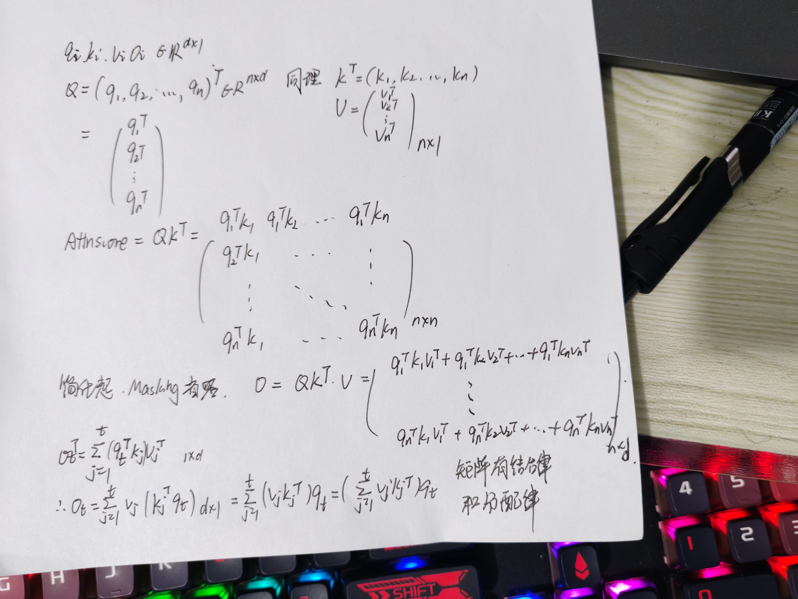

+++
date = '2026-01-30'
draft = false
title = 'Be a good engineer'
image = ''
author = 'DaYang'
categories = ['Notes']

+++

## 成为一个好的工程师  

### 基本功笔记  
主流并行框架（DDP/DeepSpeed/Megatron）均基于 SPMD（Single Program Multiple Data）架构：所有进程执行相同代码逻辑，通过环境变量差异自主确定行为模式，无需中心调度节点。灵活性不如single-controller模式。

计算GPU称为Worker，梯度聚合GPU称为Server

#### AllReduce
目前最通用的AllReduce方法：Ring-AllReduce。它由百度最先提出，非常有效地解决了数据并行中通讯负载不均的问题，使得DDP得以实现

Ring-ALLReduce("先富带动后富"思想)则分两大步骤实现该目标：Reduce-Scatter(圆排列转一圈后所有参数都有一个位置已经都更新完成)和All-Gather(把每一部分更新完的参数更新到其他的)

Ring-AllReduce的方法，因为在之后的ZeRO，Megatron-LM中，它将频繁地出现，是分布式训练系统中重要的算子


#### ZeRO(DP)

[图解大模型训练之：数据并行上篇(DP, DDP与ZeRO)](https://zhuanlan.zhihu.com/p/617133971)  
[图解大模型训练之：数据并行下篇(DeepSpeed ZeRO，零冗余优化)](https://zhuanlan.zhihu.com/p/618865052)  

ZeRO是模型并行的形式，数据并行的实质
- 模型并行，是指在forward和backward的过程中，我只需要用自己维护的那块W来计算就行。即同样的输入X，每块GPU上各算模型的一部分，最后通过某些方式聚合结果。
但对ZeRO来说，它做forward和backward的时候，是需要把各GPU上维护的W聚合起来的，即本质上还是用完整的W进行计算。它是不同的输入X，完整的参数W，最终再做聚合。

对activation的存储是灵活的。不像optimizer states，gradients和parameters对模型更新是必须的，activation只是起到加速梯度计算的作用。因此，在哪几层保存activation，保存哪些activation都是可以灵活设置的。

ZeRO-Offload
- forward和backward计算量高，因此和它们相关的部分，例如参数W（fp16），activation，就全放入GPU。
- update的部分计算量低，因此和它相关的部分，全部放入CPU中。例如W(fp32)，optimizer states（fp32）和gradients(fp16)等。

#### TP  

[图解大模型训练之：张量模型并行(TP)，Megatron-LM](https://zhuanlan.zhihu.com/p/622212228)  

在之前的内容中，已经介绍过流水线并行(PP)、数据并行(DP，DDP和ZeRO)。下面将要介绍最重要，也是目前基于Transformer做大模型预训练最基本的并行范式：来自NVIDIA的张量模型并行(TP)。它的基本思想就是把模型的参数纵向切开，放到不同的GPU上进行独立计算，然后再做聚合。

#### 关于随机种子设定的一般结论  

一般在TP/PP组内，设定不同的随机种子。而在DP组内，设定相同的随机种子。这只是一个一般结论，我们可以根据实际情况去调整  

#### python杂谈    

语言本身没有任何限制。在Python中，可以通过给对象属性名添加前缀下划线的方式来说明属性的访问可见性，例如，可以用__name表示一个私有属性，_name表示一个受保护属性。  

下划线(_)开头表示Python中的私有变量, 但私有变量在Python中不存在, 只需遵循一些规范即可  

除了对象方法之外，类中还可以有静态方法和类方法，这两类方法是发给类的消息，二者并没有实质性的区别  

可以直接使用类名.方法名的方式来调用静态方法和类方法，二者的区别在于，类方法的第一个参数是类对象本身，而静态方法则没有这个参数  

简单的总结一下，对象方法、类方法、静态方法都可以通过类名.方法名的方式来调用，区别在于方法的第一个参数到底是普通对象还是类对象，还是没有接受消息的对象。静态方法通常也可以直接写成一个独立的函数，因为它并没有跟特定的对象绑定  

super().__init__()来调用父类初始化方法，super函数是Python内置函数中专门为获取当前对象的父类对象而设计的  

子类继承父类的方法后，还可以对方法进行重写（重新实现该方法），不同的子类可以对父类的同一个方法给出不同的实现版本，这样的方法在程序运行时就会表现出多态行为（调用相同的方法，做了不同的事情）  

---

在没有特殊处理的情况下，函数的参数都是位置参数，也就意味着传入参数的时候对号入座即可  
调用函数时，如果希望函数的调用者必须以参数名=参数值的方式传参，可以用命名关键字参数（keyword-only argument）取代位置参数。所谓命名关键字参数，是在函数的参数列表中，写在*之后的参数  

在函数的参数列表中可以使用可变参数*args来接收任意数量的参数  
关键字参数会将传入的带参数名的参数组装成一个字典，参数名就是字典中键值对的键，而参数值就是字典中键值对的值  

不带参数名的参数（位置参数）必须出现在带参数名的参数（关键字参数）之前  

---

#### 理论推导  

#### 语言模型（Language Model）中最经典的交叉熵损失函数（Cross-Entropy Loss）  

在概率论和深度学习中，给概率 $P$ 取对数（$\log$）绝不是为了让公式看起来更高级，而是出于数学稳定性、计算效率以及优化便利性的深度考量  

语言模型的目标是最大化整个序列出现的概率。假设一个序列有 $T$ 个词，其联合概率是每一个词出现的条件概率的连乘：$$P(x_1, x_2, \dots, x_T) = \prod_{t=1}^{T} P(x_t | x_{<t})$$

证明:  
- e.g.

    $P(x_1, x_2, x_3) = P(x_1, x_2) \cdot P(x_3 | x_1, x_2)$    

    $P(x_1, x_2) = P(x_1) \cdot P(x_2 | x_1)$  

    =>$P(x_1, x_2, x_3) = P(x_1) \cdot P(x_2 | x_1) \cdot P(x_3 | x_1, x_2)$

- 递归进行约分  

    $P(x_1, \dots, x_T) = P(x_1, \dots, x_{T-1}) \cdot P(x_T | x_1, \dots, x_{T-1})$  

    $P(x_1, \dots, x_{T-1}) = P(x_1, \dots, x_{T-2}) \cdot P(x_{T-1} | x_1, \dots, x_{T-2})$  

    ......  

    直到拆到 $P(x_1)$  

    两边约分 => $P(x_1, \dots, x_T) = P(x_1) \cdot P(x_2|x_1) \cdot P(x_3|x_{1,2}) \dots P(x_T|x_{<T}) = \prod_{t=1}^{T} P(x_t | x_{<t})$
> 注：当 $t=1$ 时，$x_{<1}$ 为空集，即起始词概率 $P(x_1)$。

#### SFT  
next token loss或者叫lm loss，这是现代语言模型最原始、最直接的训练方式：  

$\mathcal{L}_{lm} = -\frac{1}{T} \sum_{t=1}^{T} log P(x_t | x_{<t})$  

#### DPO  
优化目标是最大化给定 $x$,$y_l$,$y_w$下，好answer优于坏answer的概率  

$\mathcal{L}_{DPO} = -\mathbb{E} \left[ \log \sigma \left( \beta \log \frac{\pi_\theta(y_w|x)}{\pi_{ref}(y_w|x)} - \beta \log \frac{\pi_\theta(y_l|x)}{\pi_{ref}(y_l|x)} \right) \right]$  

- 其中 $\pi_\theta$,$\pi_{ref}$分别表示正在训练的模型和冻住不训的参考模型， 
 $x$,$y_l$,$y_w$分别表示prompt，较差的answer和较好的answer。

目前工业界稳定跑通的DPO，很多用的都是下面这个公式：  
$\mathcal{L}_{DPO} = -\mathbb{E} \left[ \log \sigma \left( \beta \log \frac{\pi_\theta(y_w|x)}{\pi_{ref}(y_w|x)} - \beta \log \frac{\pi_\theta(y_l|x)}{\pi_{ref}(y_l|x)} \right) +  \alpha \log \pi_\theta(y_w|x) \right]$   

另外额外提一嘴，DPO训练的时候 $\pi(y|x)$ 是 $\sum_{t=1}^{T} P(y_t|x_{<t})$ ，而不是 $\frac{1}{T} \sum_{t=1}^{T} P(y_t|x_{<t})$ ，这个原理我没有细究，因为我用的也不多。  

#### RST(Rejection Sampling Fine-tuning)  

我们希望充分利用偏好对训练出来的 $\pi^*$ 模型，但是 $\pi^*$ 又是个判别模型。既然判别模型做不了生成，那就找个生成的模型来采样，判别模型负责拒绝就可以了，于是也就有了拒绝采样的训练  

offline RST的一般流程如下：

1. 用经过SFT 的模型或few shot的 pretrain 模型回答 SFT 所有训练数据的问题，得到模型answer    
2. 用奖励模型对SFT数据中原始的answer和模型生成answer进行打分  
3. 得分 top1 的answer 去替换SFT数据中的原始answer，产生新的一版训练数据  
4. 新的数据去训练1中用来生成answer的模型    
5. 重复1-4：模型回答SFT数据->打分->top1替换得到新版数据->训练模型->模型回答SFT数据->打分->....  


### Attention  

定义

$$\mathbf{q}_i, \mathbf{k}_i, \mathbf{v}_i, \mathbf{o}_i \in \mathbb{R}^{d \times 1} $$

$$\mathbf{Q} = [\mathbf{q}_1, \mathbf{q}_2, \dots, \mathbf{q}_n]^\top \in \mathbb{R}^{n \times d} $$

$$\mathbf{K} = [\mathbf{k}_1, \mathbf{k}_2, \dots, \mathbf{k}_n]^\top \in \mathbb{R}^{n \times d} $$

$$\mathbf{V} = [\mathbf{v}_1, \mathbf{v}_2, \dots, \mathbf{v}_n]^\top \in \mathbb{R}^{n \times d} $$

$$\mathbf{O} = [\mathbf{o}_1, \mathbf{o}_2, \dots, \mathbf{o}_n]^\top \in \mathbb{R}^{n \times d}$$


#### Softmax Attention  

Softmax Attention通常指 Attention is all you need 中的Attention机制  

$$\mathbf{O} = \text{softmax}(\mathbf{Q}\mathbf{K}^\top + \log \mathbf{M})\mathbf{V}$$  

$$o_t = \sum_{j=1}^{t} \left( \underbrace{\frac{\exp(\boldsymbol{q}_t^\top \boldsymbol{k}_j)}{\sum_{j=1}^{t} \exp(\boldsymbol{q}_t^\top \boldsymbol{k}_j)}}_{\text{权重 } \alpha_{tj}} \right) \cdot \boldsymbol{v}_j= \frac{\sum_{j=1}^{t} \exp(\mathbf{q}_t^\top \mathbf{k}_j) \mathbf{v}_j}{\sum_{j=1}^{t} \exp(\mathbf{q}_t^\top \mathbf{k}_j)}$$  

> 里面的分母可以提出来，每一项那部分都是常数  

如果对最终输出O进行RMSNorm(Root Mean Square Layer Normalization)，分母会被消去，所以认为重点是分子部分  

$$\mathbf{O} = \exp(\mathbf{Q}\mathbf{K}^\top + \log \mathbf{M})\mathbf{V} = (\exp(\mathbf{Q}\mathbf{K}^\top) \odot \mathbf{M})\mathbf{V} $$

> 其中⊙是hadmard积(逐元素积,相同形状的矩阵对应位置元素相乘)  

#### Linear Attention  

一开始的Linear Attention是模拟softmax attention,一种最简单的做法是去掉exp  $$\mathbf{O} = (\mathbf{Q}\mathbf{K}^\top \odot \mathbf{M})\mathbf{V}$$

对于非Causal的注意力计算(没有$\mathbf{M}$)，可以通过矩阵交换律改变计算顺序得到线性的计算 $$\mathbf{O} = \mathbf{Q}(\mathbf{K}^\top \mathbf{V})$$

> 原本$QK^\top$的时间复杂度是$O(n^{2}d)$，现在$K^\top V$的时间复杂度是$O(nd^{2})$，与Q相乘仍然是$O(nd^{2})$  

$$
\mathbf{o}_t = \sum_{j=1}^{t} \mathbf{v}_j (\mathbf{k}_j^\top \mathbf{q}_t) = \sum_{j=1}^{t} (\mathbf{v}_j \mathbf{k}_j^\top) \mathbf{q}_t = \left( \sum_{j=1}^{t} \mathbf{v}_j \mathbf{k}_j^\top \right) \mathbf{q}_t
$$  

下图手证 $\mathbf{o}_t = \sum_{j=1}^{t} \mathbf{v}_j (\mathbf{k}_j^\top \mathbf{q}_t)$ ,记住矩阵有结合律和分配律, 没有交换律和消去律  

  

将括号部分标记为 $S_t$ ,有 $$
\mathbf{o}_t = \mathbf{S}_t \mathbf{q}_t, \quad \mathbf{S}_t = \mathbf{S}_{t-1} + \mathbf{v}_t \mathbf{k}_t^\top
$$  

#### DeltaNet  

最早的线性Attention对应的损失函数是 $-v^T(Sk)$  

一个更理想更直接的损失可能是MSE/L2 Loss，即 $\frac{1}{2} \|Sk - v\|^2$ DeltaNet便使用了这样的损失  
$$o_t = f(S_t; q_t), \quad S_t = S_{t-1} - \underbrace{\eta_t (S_{t-1} k_t - v_t) k_t^\top}_{\nabla_{S_{t-1}} \frac{1}{2} \| S_{t-1} k_t - v_t \|^2}$$
​
$ \eta_t $是一个常数，不妨设其为1方便分析
将式子拆开可以得到  

$$
\begin{aligned}
S_t &= S_{t-1} - (S_{t-1}\boldsymbol{k}_t - \boldsymbol{v}_t)\boldsymbol{k}_t^\top \\
&= S_{t-1} - (S_{t-1}\boldsymbol{k}_t)\boldsymbol{k}_t^\top + \boldsymbol{v}_t\boldsymbol{k}_t^\top \\
&= S_{t-1}(\boldsymbol{I} - \boldsymbol{k}_t\boldsymbol{k}_t^\top) + \boldsymbol{v}_t\boldsymbol{k}_t^\top
\end{aligned}
$$  

相比于一开始的状态更新，DeltaNet的状态更新之前先减去了一个 $(S_{t-1}\boldsymbol{k}_t)\boldsymbol{k}_t^\top, \quad S_{t-1}\boldsymbol{k}_t$ 是模型对v的预测，所以这里就有点像是 去除模型的旧知识，加入正确的新知识。这个规则称为Delta Rule，也是Delta的来源  

联想记忆（Associative Memory） 或 线性注意力 机制中，如何从存储矩阵 $S$ 中通过键 $k_j$ 检索出对应值 $v_j$ 的数学原理，以及为什么会产生误差?  

$$S = \sum_{i=1}^{n} v_i k_i^\top$$
$$Sk_j = \left( \sum_{i=1}^{n} v_i k_i^\top \right) k_j = \sum_{i=1}^{n} v_i (k_i^\top k_j)$$

为了看清检索结果准不准，我们将求和拆分为“目标项”（$i=j$）和“干扰项”（$i \neq j$）：当 $i = j$ 时：项为 $v_j (k_j^\top k_j)$。如果键向量是单位向量（即 $k_j^\top k_j = 1$），这一项就直接等于 $v_j$。当 $i \neq j$ 时：项为 $\sum_{i \neq j} (k_i^\top k_j) v_i$。这些是其他存储项对当前检索的干扰  

$$Sk_j = v_j + \underbrace{\sum_{i \neq j} (k_i^\top k_j) v_i}_{\text{retrieval error}}$$

#### Gated DeltaNet 

Gated DeltaNet将遗忘门加入到了DeltaNet中，它的引入方式为
$$
\boldsymbol{S}_t = \alpha_t \boldsymbol{S}_{t-1} (\boldsymbol{I} - \beta_t \boldsymbol{k}_t \boldsymbol{k}_t^\top) + \beta_t \boldsymbol{v}_t \boldsymbol{k}_t^\top
$$


### 训练经验  

#### 个人实战经验  

- PEFT（Parameter-Efficient Fine-Tuning，参数高效微调）,就是我们常说的Lora  

```model = get_peft_model(model, config)```


#### 他人经验  

[LLM实践--支线：拯救Continue Pretrain的数据](https://zhuanlan.zhihu.com/p/721492096) 这里面评论区提到的  
- SFT确实是可以注入知识的，只不过必须全参，lora完全不行，lora训十轮也学不进去，全参训一轮就学得差不多了，之前看各种文章无脑推荐高效微调法，其实是一个很大的误区。知识在整句话中其实只占很小的一部分，属于次要奇异值，lora会把这些东西忽略掉，导致学习一些hacking，比如格式、行文。所以我也说sft注入没有不可以，多样性一定保证，也要避免hacking。平时工作我也从来不用lora，因为次要奇异值往往更重要  

[LLM实践--拒绝采样](https://zhuanlan.zhihu.com/p/4547529049) 评论区  
- 所有的后训练改进过程都是在解决LM LOSS不等于预期LOSS的问题，试图去稳定性量化预期LOSS，目前的所有技术都只是通过尝试来试图接近，这是token-based paradigm的必然问题。解决这个问题的终极方案是从next-token LM model转为semantic model，用semantic loss来替代Lm loss。

### 面向进程编程  
整份脚本处理的是发生在1个进程上的事情。这样做的好处是，我们只需要维护1份脚本，然后将其发去不同机器的各张卡上执行，就能实现全局的并行。

### Megatron  
Megatron还是要看的  
[图解大模型训练之：流水线并行（Pipeline Parallelism），以Gpipe为例](https://zhuanlan.zhihu.com/p/613196255)  
[图解大模型训练之：数据并行上篇(DP, DDP与ZeRO)](https://zhuanlan.zhihu.com/p/617133971)  
[图解大模型训练之：数据并行下篇(DeepSpeed ZeRO，零冗余优化)](https://zhuanlan.zhihu.com/p/618865052)  
[图解大模型训练之：张量模型并行(TP)，Megatron-LM](https://zhuanlan.zhihu.com/p/622212228)  
[图解大模型系列之：Megatron源码解读1，分布式环境初始化](https://zhuanlan.zhihu.com/p/629121480)  
[图解大模型训练之：Megatron源码解读2，模型并行](https://zhuanlan.zhihu.com/p/634377071)  
[图解大模型训练系列之：Megatron源码解读3，分布式混合精度训练](https://zhuanlan.zhihu.com/p/662700424)  


#### pretrain部分code大致流程  
```
def pretrain(
    train_valid_test_dataset_provider,
    model_provider,
    forward_step_func,
    valid_forward_step_func=None,
    extra_args_provider=None,
    args_defaults={},
):  
    # 1.初始化分布式环境(源码解读1内容)
    initialize_megatron(
        extra_args_provider=extra_args_provider, args_defaults=args_defaults
    )
    ...
    # 2、模型并行：定义模型架构，并切割模型（本文重点）
    model, optimizer, lr_scheduler = setup_model_and_optimizer(model_provider)
    ...
    
    # 3、构造train/val/test数据集（下一篇将讲述）
    ... (
            train_data_iterator,
            valid_data_iterator,
            test_data_iterator,
        ) = build_train_valid_test_data_iterators(train_valid_test_dataset_provider) 
    
    ...
    # 4、训练（下下一篇将讲述）
    iteration = train(
            forward_step_func,
            valid_forward_step_func,
            model,
            optimizer,
            lr_scheduler,
            train_data_iterator,
            valid_data_iterator,
        )
    
    ...
```

#### CrossEntropy

在语言模型训练中，我们需要计算预测分布与真实标签之间的交叉熵损失。对于单个样本，交叉熵损失定义为：

$$
L = -\log P(y|x) = -\log\left(\frac{e^{s_y}}{\sum_{j=1}^{V} e^{s_j}}\right) = \log\left(\sum_{j=1}^{V} e^{s_j}\right) - s_y
$$

其中：
- $s = [s_1, s_2, \ldots, s_V]$ 是模型输出的 logits（未归一化的对数概率）
- $V$ 是词汇表大小
- $y$ 是真实标签
- $s_y$ 是真实类别对应的 logit

**数值稳定性处理**

为了数值稳定性，我们在计算 softmax 前先减去最大值：

$$
\text{logits}' = s - \max(s)
$$

这样做的理由：
1. 防止 $\exp(s)$ 溢出
2. 不改变 softmax 结果（分子分母同时乘以 $e^{-\max(s)}$）

**词汇表并行（Vocab Parallel）**

在张量并行中，词汇表被切分到多个 GPU 上：
- 假设有 $N$ 个 GPU，词汇表大小为 $V$
- 每个 GPU 维护 $V/N$ 个词的 logits
- 需要通过通信（AllReduce）来计算全局的 softmax 和 loss

```python
class _VocabParallelCrossEntropy(torch.autograd.Function):
    @staticmethod
    def forward(ctx, vocab_parallel_logits, target):
        """
        前向传播：计算词汇表并行下的交叉熵损失

        输入：
        - vocab_parallel_logits: [batch_size, seq_len, partition_vocab_size]
          当前 GPU 上维护的部分词汇表 logits
        - target: [batch_size, seq_len]
          真实标签（词汇表索引）

        输出：
        - loss: [batch_size, seq_len]
          每个位置的交叉熵损失
        """

        # ============ 第一步：数值稳定性处理 ============
        # 在词汇表维度上找到最大值（只在当前 GPU 的分区上找）
        # logits_max: [batch_size, seq_len]
        # 数学表达：m_i = max(s_i) 其中 s_i 是第 i 个样本的 logits
        logits_max = torch.max(vocab_parallel_logits, dim=-1)[0]

        # 通过 AllReduce 获取全局最大值（跨所有 GPU）
        # 这样确保所有 GPU 使用相同的最大值进行归一化
        # 数学表达：m_global = max(m_1, m_2, ..., m_N) 其中 N 是 GPU 数量
        torch.distributed.all_reduce(
            logits_max,
            op=torch.distributed.ReduceOp.MAX,
            group=get_tensor_model_parallel_group(),
        )

        # 减去最大值，实现数值稳定
        # logits' = logits - max(logits)
        # 这样可以防止 exp(logits) 溢出，同时不改变 softmax 结果
        # 数学表达：s'_ij = s_ij - m_global
        vocab_parallel_logits.sub_(logits_max.unsqueeze(dim=-1))

        # ============ 第二步：确定当前 GPU 的词汇表范围 ============
        # 获取当前 GPU 负责的词汇表索引范围
        # 例如：V=10000, N=4, rank=0 -> [0, 2500), rank=1 -> [2500, 5000), ...
        get_vocab_range = VocabUtility.vocab_range_from_per_partition_vocab_size
        partition_vocab_size = vocab_parallel_logits.size()[-1]  # 当前 GPU 的词汇表分区大小
        rank = get_tensor_model_parallel_rank()  # 当前 GPU 的 rank
        world_size = get_tensor_model_parallel_world_size()  # 总 GPU 数量
        vocab_start_index, vocab_end_index = get_vocab_range(
            partition_vocab_size, rank, world_size
        )

        # ============ 第三步：创建目标掩码 ============
        # 判断哪些目标在当前 GPU 的词汇表范围内
        # target_mask=True 表示目标不在当前 GPU 的词汇表范围内
        # 数学表达：mask_i = 1 if (target_i < start) or (target_i >= end), else 0
        target_mask = (target < vocab_start_index) | (target >= vocab_end_index)

        # 将全局目标索引转换为当前 GPU 的局部索引
        # 数学表达：target'_i = target_i - vocab_start_index
        masked_target = target.clone() - vocab_start_index

        # 将不在当前范围内的目标设为 0（之后会被 mask 掉）
        masked_target[target_mask] = 0

        # ============ 第四步：提取目标位置的 logit ============
        # 将 logits 展平为 2D：[batch_size * seq_len, partition_vocab_size]
        # 将 target 展平为 1D：[batch_size * seq_len]
        # 这样方便使用高级索引
        logits_2d = vocab_parallel_logits.view(-1, partition_vocab_size)
        masked_target_1d = masked_target.view(-1)

        # 创建行索引 [0, 1, 2, ..., batch_size * seq_len - 1]
        arange_1d = torch.arange(
            start=0, end=logits_2d.size()[0], device=logits_2d.device
        )

        # 提取每个样本对应目标位置的 logit
        # 数学表达：s'_target = logits[arange_1d, masked_target_1d]
        # 即取出每个样本在其目标词汇位置的 logit 值
        predicted_logits_1d = logits_2d[arange_1d, masked_target_1d]
        predicted_logits_1d = predicted_logits_1d.clone().contiguous()

        # 恢复原始形状：[batch_size, seq_len]
        predicted_logits = predicted_logits_1d.view_as(target)

        # 将不在当前 GPU 范围内的目标的 logit 设为 0
        # 这样做是因为之后会通过 AllReduce 求和，只需要贡献自己的部分
        predicted_logits[target_mask] = 0.0

        # 通过 AllReduce 从所有 GPU 收集目标的 logit
        # 每个 GPU 只贡献自己分区内的目标 logit
        # 最终得到所有目标位置的完整 logit 值
        # 数学表达：s_y = Σ(s'_y_i) 对所有 GPU 求和
        torch.distributed.all_reduce(
            predicted_logits,
            op=torch.distributed.ReduceOp.SUM,
            group=get_tensor_model_parallel_group(),
        )

        # ============ 第五步：计算归一化项（log-sum-exp）============
        # 计算 exp(logits')
        # 数学表达：e'_ij = exp(s'_ij)
        exp_logits = vocab_parallel_logits
        torch.exp(vocab_parallel_logits, out=exp_logits)

        # 在当前 GPU 的词汇表维度上求和
        # 数学表达：E'_i = Σ(e'_ij) 对当前 GPU 的词汇表维度求和
        sum_exp_logits = exp_logits.sum(dim=-1)

        # 通过 AllReduce 从所有 GPU 收集完整的指数和
        # 数学表达：E_i = Σ(E'_i) 对所有 GPU 求和
        # 这就是 softmax 的分母：Σ(exp(s_j))
        torch.distributed.all_reduce(
            sum_exp_logits,
            op=torch.distributed.ReduceOp.SUM,
            group=get_tensor_model_parallel_group(),
        )

        # ============ 第六步：计算最终损失 ============
        # 交叉熵损失：L = log(sum(exp(logits))) - predicted_logit
        # 数学表达：L = log(E_i) - s_y
        # 这对应：L = log(Σ(exp(s_j))) - s_y
        # 即：L = -log(exp(s_y) / Σ(exp(s_j))) = -softmax_y
        loss = torch.log(sum_exp_logits) - predicted_logits

        # ============ 第七步：保存反向传播所需的中间变量 ============
        # 计算 softmax 并保存，用于反向传播
        # 数学表达：softmax_ij = exp(s'_ij) / E_i
        exp_logits.div_(sum_exp_logits.unsqueeze(dim=-1))

        # 保存 softmax、target_mask 和 masked_target_1d 用于反向传播
        ctx.save_for_backward(exp_logits, target_mask, masked_target_1d)

        return loss

    @staticmethod
    def backward(ctx, grad_output):
        """
        反向传播：计算交叉熵损失对 logits 的梯度

        数学推导：
        前向传播：L = log(Σ(exp(s_j))) - s_y

        对 logits 的梯度：
        ∂L/∂s_i = softmax_i - 1_{i=y}

        其中：
        - softmax_i = exp(s_i) / Σ(exp(s_j))
        - 1_{i=y} 是指示函数，当 i=y 时为 1，否则为 0

        在词汇表并行的场景下：
        - 当前 GPU 只计算自己分区内的梯度
        - 对于目标位置：grad = softmax - 1
        - 对于非目标位置：grad = softmax
        """

        # ============ 第一步：恢复前向传播保存的中间变量 ============
        # softmax: [batch_size, seq_len, partition_vocab_size]
        # target_mask: [batch_size, seq_len] (布尔掩码)
        # masked_target_1d: [batch_size * seq_len] (局部索引)
        softmax, target_mask, masked_target_1d = ctx.saved_tensors

        # ============ 第二步：初始化梯度 ============
        # 交叉熵损失的梯度基础是 softmax 值
        # 对于所有位置，梯度从 softmax 开始
        # 数学表达：∂L/∂s_i = softmax_i （基础项）
        grad_input = softmax

        # 为了方便索引，转换为 2D 格式
        # grad_2d: [batch_size * seq_len, partition_vocab_size]
        partition_vocab_size = softmax.size()[-1]
        grad_2d = grad_input.view(-1, partition_vocab_size)

        # ============ 第三步：处理目标位置的梯度 ============
        # 对于目标位置，需要减去 1（指示函数）
        # 数学表达：∂L/∂s_y = softmax_y - 1
        # 其中 1 是真实标签的指示函数 1_{i=y}

        # 创建行索引
        arange_1d = torch.arange(start=0, end=grad_2d.size()[0], device=grad_2d.device)

        # 对目标位置的梯度进行调整：
        # 1. 如果目标在当前 GPU 的词汇表范围内（target_mask=False）：
        #    grad = softmax - 1 （减 1）
        # 2. 如果目标不在当前范围内（target_mask=True）：
        #    grad = softmax - 0 （不减 1，因为目标在其他 GPU 上）
        # 数学表达：
        # ∂L/∂s_y = softmax_y - (1 - mask_y)
        # 其中 mask_y = 1 表示目标不在当前 GPU，mask_y = 0 表示目标在当前 GPU
        grad_2d[arange_1d, masked_target_1d] -= 1.0 - target_mask.view(-1).float()

        # ============ 第四步：乘以上层梯度 ============
        # 根据链式法则，需要乘以损失对输出的梯度
        # 数学表达：∂L_total/∂s = (∂L/∂s) × (∂L_total/∂L)
        # 其中 grad_output 是 ∂L_total/∂L
        grad_input.mul_(grad_output.unsqueeze(dim=-1))

        # 返回梯度（第二个输入 target 不需要梯度，返回 None）
        return grad_input, None


def vocab_parallel_cross_entropy(vocab_parallel_logits, target):
    """Helper function for the cross entropy."""
    return _VocabParallelCrossEntropy.apply(vocab_parallel_logits, target)
```


#### 精度问题  

从占用存储角度看，fp16占据2 bytes，bf16占据2 bytes，fp32占据4 bytes  
从数值表达范围来看：fp32 = bf16 > fp16  
从数值表达精度来看：fp32 > fp16 > bf16  

最好理解每一部分精度转换的原因和整个流程，算是基本功  

老样子，放一些写的好的文章可以学一学  

[图解大模型训练系列之：Megatron源码解读3，分布式混合精度训练](https://zhuanlan.zhihu.com/p/662700424)  
megatron/training.py的pretrain 函数。其中，函数setup_model_and_optimizer调用了optimizer/__init__.py/下的get_megatron_optimizer，因此它就是混合精度训练的入口函数  

[分析transformer模型的参数量、计算量、中间激活、KV cache](https://zhuanlan.zhihu.com/p/624740065)  

两种做Loss Scale的方法：常量损失放大和动量损失放大  


### DeepSpeed  
[DeepSpeed官方文档](https://huggingface.co/docs/transformers/deepspeed)👈官方文档  
[DeepSpeed配置JSON](https://www.deepspeed.ai/docs/config-json/)👈使用只需要JSON配置文件  
[【利用多張GPU訓練大型語言模型】 - YouTube](https://www.youtube.com/watch?v=mpuRca2UZtI&t=2925s)👈李宏毅老师YouTube视频讲解（约一个小时）  
[The Ultra-Scale Playbook:Training LLMs on GPU Clusters](https://huggingface.co/spaces/nanotron/ultrascale-playbook)👈并行训练高质参考资料  

> hugging face经常有高质量实验总结，可以多关注一下


一开始会有batch-size个prompt去做rollout，每个prompt rollout出n个response，之后每mini-batch-size个prompt及其rollout出来的response会去做一次梯度下降，batch-size / mini-batch-size次梯度下降之后一个step结束

- Batch Size Related Parameters
**train_batch_size** = **train_micro_batch_size_per_gpu** * **gradient_accumulation_steps** * **number of GPUs**  
- train_batch_size: [integer]
代表着one step.Example:32  
- train_micro_batch_size_per_gpu: [integer]
一次更新的batch_size，所以叫micro_batch_size. 
- gradient_accumulation_steps: [integer]
积累几次  

一开始会有batch-size个prompt去做rollout，每个prompt rollout出n个response，之后每mini-batch-size个prompt及其rollout出来的response会去做一次梯度下降，batch-size / mini-batch-size次梯度下降之后一个step结束


### 监控平台
可以使用TensorBoard,wandb,Comet等，因为个人使用所以只介绍swanlab(wandb的国内镜像)  
注册登录，设置 project_name 和 experiment_name 就可以在电脑上/手机上看了  
很好用的监控平台！  
[swanlab官方文档](https://docs.swanlab.cn/)👈官方文档 


### veRL框架使用方法/快速上手
知乎上收藏了一些轮椅教程  
[OpenRLHF&Verl参数转换指南](https://zhuanlan.zhihu.com/p/29149216967)  

更深入的：  
[HybridFlow / veRL 原文浅析](https://zhuanlan.zhihu.com/p/24682036412)很干，对system理解有很大帮助  

[[AI Infra] VeRL 框架入门&代码带读](https://zhuanlan.zhihu.com/p/27676081245)  

[从零开始的verl框架解析](https://zhuanlan.zhihu.com/p/30876678559)  
